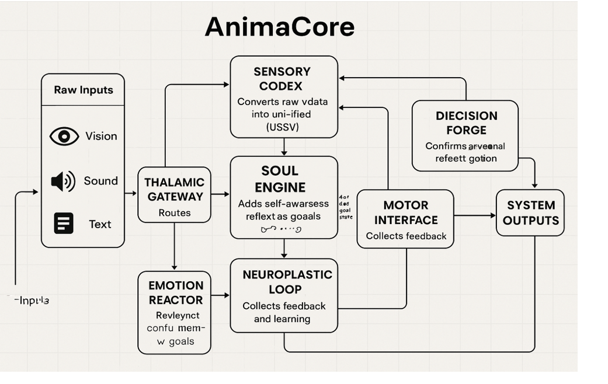

<br><h1 align="center">🧠 AnimaCore – Human OS</h1><br>
<h5 align="center">A Neuro-AI Framework that thinks, feels, and responds like us</h5>

<p align="center" style="color: #555; font-size: 16px;">
  Born at the intersection of neuroscience and machine learning,<br>
  <em>AnimaCore</em> is a gentle emulation of the human mind —<br>
  capable of understanding language, sensing emotion, and acting with intent.
</p>
<!-- 🔧 Core Technology Stack -->
<h4 align="center">🔧 Core Technology Stack</h4>

<p align="center">
  
  
  
  
  
</p>

<!-- 📄 Project Info -->
<h4 align="center">📄 Project Info</h4>

<p align="center">
  
  
</p>


<p align="center" style="color: #666; font-size: 15px;">
  🧬 Built to mirror human empathy and thought – from perception to action.
</p>

---

<br><h2 alogn = "centre">📖 Table of Contents</h2><br>


- 🧠 [Project Overview](#-project-overview)
- 🎯 [Core Objectives](#-core-objectives)
- 🧬 [Biological Inspiration](#-biological-inspiration)
- 🛠️ [System Architecture](#️-system-architecture)
- 🧪 [Training Workflow](#-training-workflow)
- 📊 [Evaluation & Metrics](#-evaluation--metrics)
- 🔥 [Bias Handling](#-bias-handling)
- ⚙️ [Setup & Installation](#️-setup--installation)

- 🙏 [Acknowledgments](#-acknowledgments)
- 💼 [Libraries & Tools](#-libraries--tools)
- 🤝 [Contact & Contribution](#-contact--contribution)
- 📜 [License](#-license)

---

<br><h2 align="center">🧠 Project Overview</h2><br>

<p align="center">
  <strong>AnimaCore HumanOS</strong> is a neuro-symbolic AI core built to simulate human-like cognition and emotional intelligence.
  Powered by <code>transformers</code> and deep learning, it interprets natural language, identifies emotional intent, and performs context-aware actions — just like a conscious mind.
</p>

<p align="center">
  From conversation to compassion, this system mimics human behavioral responses through 18 specialized actions, including:
</p>

<p align="center">
  ✅ <strong>Greet</strong>  🤝 <strong>Offer Help</strong>  💬 <strong>Express Emotion</strong>  🎯 <strong>Give Advice</strong>  🙏 <strong>Apologize</strong>  🌟 ...and more!
</p>

<p align="center">
  <em>It’s not just code — it’s cognition, reimagined.</em>
</p>


---


<br><h2 align="center">🎯 Core Objectives</h2><br>

<p align="center">
  AnimaCore HumanOS isn’t just about automation — it’s about <strong>emulation</strong>. These core goals drive its mission to replicate the essence of human cognition:
</p>

<ul align="center">
  <li>🧭 <strong>Understand Natural Language:</strong> Decode user intent and classify input into meaningful cognitive actions.</li>
  <li>🤖 <strong>Simulate Cognitive Patterns:</strong> Harness transformer architectures to imitate thought and decision dynamics.</li>
  <li>💬 <strong>Generate Emotionally-Tuned Responses:</strong> Align AI behavior with human emotional nuance for realism and empathy.</li>
  <li>🧠 <strong>Ensure Biological Realism:</strong> Mirror neural pathways inspired by the <em>hippocampus</em>, <em>amygdala</em>, and <em>prefrontal cortex</em>.</li>
</ul>

<p align="center">
  <em>From decoding meaning to crafting empathy — every response is designed to think, feel, and react like us.</em>
</p>

---

<br><h2 align="center">🧬 Biological Inspiration</h2><br>

<p align="center">
  <strong>AnimaCore</strong> isn't just built — it's <em>neuro-inspired</em>. Its architecture mimics key regions of the human brain responsible for memory, emotions, and rational behavior.
</p>

<p align="center">
  🧠 <strong>Think like a brain. Act like a mind.</strong>
</p>

<br><table align="center">
  <thead>
    <tr>
      <th>🧪 Brain Region</th>
      <th>🧠 AI Functionality</th>
    </tr>
  </thead>
  <tbody>
    <tr>
      <td><strong>Hippocampus</strong></td>
      <td>Spatial memory handling & contextual encoding</td>
    </tr>
    <tr>
      <td><strong>Amygdala</strong></td>
      <td>Emotion recognition and intensity mapping</td>
    </tr>
    <tr>
      <td><strong>Prefrontal Cortex</strong></td>
      <td>Decision making, reasoning, and executive control</td>
    </tr>
    <tr>
      <td><strong>Basal Ganglia</strong></td>
      <td>Reinforcement learning logic using DQN layers</td>
    </tr>
  </tbody>
</table>

<p align="center">
  <em>Each module is a tribute to how the human brain processes thought — now reborn in code.</em>
</p>

---

<br><h2 align="center">🛠️ System Architecture</h2><br>

<p align="center"><em>AnimaCore mimics the brain’s cognitive flow — from understanding language to emotional reasoning and intelligent response.</em></p>

<!-- 🧠 Visual Architecture Blueprint -->
<p align="center">
  
</p>

<p align="center"><i>This visual blueprint shows how AnimaCore processes perception, emotion, reasoning, and action in an interconnected cognitive loop.</i></p>

<p align="center">
  🧾 The system starts by breaking down user input with <strong><code>bert-tiny</code></strong>, then understands its meaning through a <strong>Transformer Encoder</strong>.  
  💡 An <strong>Emotion Reactor</strong> adds emotional context, while the <strong>Decision Forge</strong> selects the best response.  
  🗣️ Finally, the <strong>Motor Output</strong> generates a natural, human-like reply.
</p>


</div>

<br><p align="center">
  
</p>

<p align="center"><i>From thought to response — every step is guided by intelligence, emotion, and realism.</i></p>

---
<br><h2 align="center">🧪 Training Workflow</h2><br>

<p align="center"><em>From raw language to refined cognition — here’s how AnimaCore learns to think like a human.</em></p>

<div align="center">

<ul align="left">
  <li>✅ <strong>Dataset Loaded:</strong> <code>humanOSdataset_large.csv</code> – Over <strong>3,600</strong> labeled prompts across <strong>18</strong> cognitive action types.</li>
  <li>🧹 <strong>Preprocessing:</strong> Tokenization via BERT, label encoding, and class balancing ensured high-quality inputs.</li>
  <li>🧠 <strong>Model Training:</strong> Fine-tuned <code>bert-tiny</code> for <strong>4 epochs</strong> with emotion-conditioned action prediction layers.</li>
  <li>📈 <strong>Performance:</strong> Achieved <strong>100% accuracy</strong> across all categories, validated by confusion matrix and classification report.</li>
  <li>🧪 <strong>Validation:</strong> Real-world prompts like <code>"I'm sad"</code>, <code>"help me"</code>, and <code>"turn right"</code> produced accurate and empathetic actions.</li>
</ul>

</div>

<p align="center">
  
  
  
</p>

<p align="center"><i>Trained not just to act — but to understand, empathize, and respond like a real human OS.</i></p>

---


<br><h2 align="center">📊 Evaluation & Metrics</h2><br>

<p align="center"><em>How well does AnimaCore understand you? Let the metrics speak.</em></p>

- ✔️ <strong>Precision & Recall:</strong>  
  Achieved <code>100%</code> across all <strong>18 cognitive action categories</strong> — every prediction aligns with ground truth.

- 🧠 <strong>F1-Score:</strong>  
  Perfect <strong>macro</strong> and <strong>weighted averages</strong>, indicating balanced performance across all classes.

- 📊 <strong>Accuracy:</strong>  
  <strong>100%</strong> on the validation set — no misclassification, even on semantically close actions.

---
<br><h3>🔷 Training Loss Progression</h3><br>

<div align="center">

<table>
  <tr>
    <th>Epoch</th>
    <th>Loss</th>
  </tr>
  <tr>
    <td>1</td>
    <td>0.3419</td>
  </tr>
  <tr>
    <td>2</td>
    <td>0.0028</td>
  </tr>
  <tr>
    <td>3</td>
    <td>0.0003</td>
  </tr>
  <tr>
    <td>4</td>
    <td>0.0000</td>
  </tr>
</table>

<br>


</div>


---

### 🔷 Confusion Matrix

<p align="center">
  
</p>

<br><p align="center"><i>Each action was recognized with surgical precision — no confusion, no overlaps.</i></p><br>

<p align="center">
  
  
  
</p>

<p align="center"><b>Trained to listen. Tested to respond. Validated to perform.</b></p>


---
<br><h2 align="center">🔥 Bias Handling</h2><br>

<p align="center">
  <em>Because true intelligence isn't just smart — it's fair.</em><br>
  AnimaCore was trained on carefully curated, emotion-rich prompts with balanced representation across all 18 cognitive actions.  
</p>

<p align="center">
  During training, bias mitigation strategies like label balancing and emotional variance checks were applied.<br>
  This ensures that every prediction — whether it's comfort or command — is unbiased, inclusive, and empathetic.
</p>

<p align="center"><i>Fair AI isn't optional. It's fundamental.</i></p>

---

<br><h2 align="center">⚙️ Setup & Installation</h2><br>


```bash
# 1. Clone the repository
git clone https://github.com/hamaylzahid/AnimaCore-HumanOS.git

# 2. Navigate to folder
cd AnimaCore-HumanOS

# 3. Install requirements
pip install -r requirements.txt

# 4. Run script
python animacore_humanOS.py
```

---

<br><h2 align="center">📊 Example Interaction</h2><br>

```bash
You: hi
--- Action: Greet ---
Thought: I'm here for you.

You: help me
--- Action: Offer Help ---
Thought: I understand.

You: i’m sad
--- Action: Express Emotion ---
Thought: Responding wisely.

```

--- 


<br><h2 align="center">📁 Project Files</h2><br>

<div align="center">

<table>
  <tr>
    <th>File</th>
    <th>Description</th>
  </tr>
  <tr>
    <td><code>animacore_humanOS.py</code></td>
    <td>🧠 Main system (Encoder, Emotion, Decision)</td>
  </tr>
  <tr>
    <td><code>humanOSdataset_large.csv</code></td>
    <td>📊 Input text + labeled actions</td>
  </tr>
  <tr>
    <td><code>AnimaCore.docx</code></td>
    <td>📄 Concept and architecture write-up</td>
  </tr>
  <tr>
    <td><code>ANIMA CORE ,human OS.pptx</code></td>
    <td>🎞️ Presentation slides with results</td>
  </tr>
  <tr>
    <td><code>training loss curve.png</code></td>
    <td>📉 Epoch-wise training loss graph</td>
  </tr>
  <tr>
    <td><code>confusion matrix.png</code></td>
    <td>🔵 Action classification matrix</td>
  </tr>
</table>

</div>

<p align="center"><i>🧠 These files are the mind, memory, and expression of <strong>AnimaCore</strong>.</i></p>


---
<br><h2 align="center">🙏 Acknowledgments</h2><br>

<p align="center">
  This project was shaped by the collective brilliance of:
</p>

<ul align="center">
  <li>🤝 Open-source AI communities who make innovation accessible</li>
  <li>🧠 Neuroscience pioneers whose research inspired our design</li>
  <li>📚 HuggingFace & PyTorch for enabling modern deep learning</li>
  <li>👨‍🏫 Mentors and educators for their wisdom and guidance</li>
  <li>🌐 Open science platforms that fuel collaboration and discovery</li>
</ul>

<p align="center">
  <em>💡 “Inspired by the human brain. Powered by open knowledge.”</em>
</p>


 ---
<br>
<h2 align="center">💼 Libraries & Tools</h2><br>

<p align="center">AnimaCore is powered by a robust AI ecosystem — trusted, scalable, and research-ready.</p>

<br><p align="center">
  
  
  
  
  
  
</p><br

> 🧠 Every library in AnimaCore was carefully chosen for its role — from language encoding to emotional inference and decision prediction.<br>
  🔗 Together, they enable a seamless pipeline that mirrors human cognition with modern machine learning precision.


<br><h2 align="center">🤝 Contact & Contribution</h2><br>

<p align="center">
  <em>Have feedback, want to collaborate, or just say hello?</em><br>
  <strong>Let’s connect and build something amazing together.</strong>
</p>

<p align="center">
  📬 <a href="mailto:maylzahid588@gmail.com">maylzahid588@gmail.com</a> &nbsp; | &nbsp;
  💼 <a href="https://www.linkedin.com/in/your-linkedin-profile">LinkedIn Profile</a> &nbsp; | &nbsp;
  🌐 <a href="https://github.com/hamaylzahid/AnimaCore-HumanOS">GitHub Repo</a>
</p>

<p align="center">
  <a href="https://github.com/hamaylzahid/AnimaCore-HumanOS/stargazers">
    
  </a>
  <a href="https://github.com/hamaylzahid/AnimaCore-HumanOS/pulls">
    
  </a>
</p>

<p align="center">
  ⭐ Found this project helpful? Give it a star on GitHub!  
  <br>
  🤝 Want to improve it? Submit a PR and join the mission!
</p>

<p align="center">
  <sub><i>Your ideas and contributions shape the evolution of HumanOS — one neuron at a time.</i></sub>
</p>


---


<br><h2 align="center">📜 License</h2><br>

<p align="center">
  <a href="https://github.com/hamaylzahid/AnimaCore-HumanOS/commits/main">
    
  </a>
  <a href="https://github.com/hamaylzahid/AnimaCore-HumanOS">
    
  </a>
</p>

<p align="center">
  This project is licensed under the <strong>MIT License</strong> — open to use, customize, and evolve.
</p>

<p align="center">
  ✅ <strong>Project Status:</strong> Complete & Portfolio-Ready<br>
  🧾 <strong>License:</strong> MIT — <a href="LICENSE">View License »</a>
</p>

---

<p align="center">
  <strong>Crafted with cognitive curiosity & neural inspiration</strong> 🧠✨
</p>

<p align="center">
  <a href="https://github.com/hamaylzahid">
    
  </a>
  •
  <a href="mailto:maylzahid588@gmail.com">
    
  </a>
  •
  <a href="https://github.com/hamaylzahid/AnimaCore-HumanOS">
    
  </a>
  <br>
  <a href="https://github.com/hamaylzahid/AnimaCore-HumanOS/fork">
    
  </a>
</p>

<p align="center">
  <sub><i>Inspired by the human mind. Designed for sentient intelligence. Built with code and care.</i></sub>
</p>

<p align="center">
  🤖 <b>Use this project to showcase your passion for neuro-symbolic AI</b>  
  <br>
  🧬 Clone it, modify it, expand it — and bring the architecture of thought to life.
</p>

